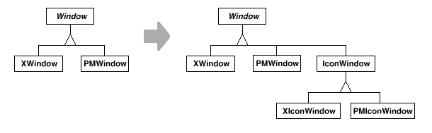
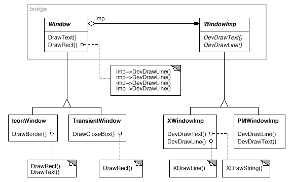
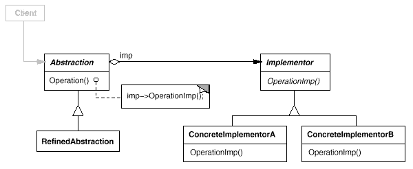

# {Bridge} (GOF) 
Desacoplar uma abstração da sua implementação, de modo que as duas possam variar
independentemente.
## Também conhecido como
Handle/Body

## Intenção
Separar a construção de um objeto complexo da sua representação de modo que o mesmo processo de construção possa criar diferentes representações.

## Motivação
Quando uma abstração pode ter uma entre várias implementações possíveis, a maneira
usual de acomodá-las é usando a herança. Uma classe abstrata define a interface para
a abstração, e subclasses concretas a implementam de formas diferentes. Mas essa
abordagem nem sempre é suficientemente flexível. A herança liga uma implementação
à abstração permanentemente, o que torna difícil modificar, aumentar e reutilizar
abstrações e implementações independentemente.
Considere a implementação de uma Janela portável em um toolkit para construir
interfaces de usuários. Por exemplo, essa abstração deveria nos habilitar a escrever
aplicações que trabalham tanto com o sistema XWindow quanto com o Presentation-
Manager (PM), da IBM. Usando a herança, poderíamos definir uma classe abstrata
Window e subclasses XWindow e PMWindow que implementam a interface Janela
para diferentes plataformas. Porém, essa abordagem tem dois problemas:
1. É inconveniente estender a abstração Window para cobrir diferentes tipos de janela ou novas plataformas. Imagine uma subclasse IconWindow de Window que especializa a abstração Window para ícones. Para suportar IconWindows para ambas as plataformas, temos que implementar duas classes novas, XIconWindow e PMIconWindow. Pior ainda, teremos que definir duas classes para cada tipo de janela. Suportar uma terceira plataforma exige ainda uma outra subclasse de Window para cada tipo de janela.

<figure>

</figure>

2. Ela torna o código do cliente dependente de plataforma. Sempre que um cliente cria uma janela, instancia uma classe concreta que tem uma implementação específica. Por exemplo, a criação de um objeto Xwindow amarra a abstração Window à implementação do XWindow, o que torna o código do cliente dependente da implementação do XWindow. Isso, por sua vez, torna mais difícil portar o código do cliente para outras plataformas.
Os clientes deveriam ser capazes de criar uma janela sem se prenderem a uma implementação concreta. Somente a implementação da janela deveria depender da plataforma na qual a aplicação é executada. Portanto, o código do cliente deveria instanciar janelas sem mencionar plataformas específicas.

O padrão Bridge trata desses problemas colocando a abstração Window e sua implementação em hierarquias de classes separadas. Existe somente uma hierarquia de classes para interfaces de janelas (Window, IconWindow, TransientWindow) e uma hierarquia separada para implementações de janelas específicas das plataformas, tendo como sua raiz WindowImp. Por exemplo, a subclasse XWindowImp fornece uma implementação baseada no sistema XWindow.

<figure>

</figure>

Todas as operações das subclasses de Window são implementadas em termos das operações abstratas da interface WindowImp. Isso desacopla as abstrações de janelas das várias implementações específicas para cada plataforma. Referimo-nos ao relacionamento entre Window e WindowImp como uma ponte (bridge) porque ela forma uma ponte entre abstração e sua implementação, permitindo que variem de forma independente.

## Aplicabilidade
Use o padrão Bridge quando:

• desejar evitar um vínculo permanente entre uma abstração e sua implementação.
Isso pode ocorrer, por exemplo, quando a implementação deve ser selecionada ou alterada em tempo de execução;

• tanto as abstrações como suas implementações tiverem de ser extensíveis por meio de subclasses. Neste caso, o padrão Bridge permite combinar as diferentes abstrações e implementações e estendê-las independentemente;

• mudanças na implementação de uma abstração não puderem ter impacto sobre os clientes; ou seja, quando o código dos mesmos não puder ser recompilado.

• (C++) você desejar ocultar completamente a implementação de uma abstração dos clientes. Em C++, a representação de uma classe é visível na interface da classe;

• tiver uma proliferação de classes, como foi mostrado no primeiro diagrama da seção Motivação. Tal hierarquia de classes indica necessidade de separar um objeto em duas partes. Rumbaugh usa o termo “generalizações aninhadas” (nested generalizations) [RPB+91] para se referir às hierarquias de cada classe;

• desejar compartilhar uma implementação entre múltiplos objetos (talvez usando
a contagem de referências) e este fato deve estar oculto do cliente. Um exemplo
simples é a classe String mencionada por Coplien [Cop92], na qual múltiplos
objetos podem compartilhar a mesma representação de uma string (StringRep).

## Estrutura

<figure>

</figure>

## Participantes
• Abstraction (Window)
– define a interface da abstração;
– mantém uma referência para um objeto do tipo Implementor.

• RefinedAbstraction (IconWindow).
– estende a interface definida por Abstraction.

• Implementor (WindowImp)
– define a interface para as classes de implementação. Essa interface não
precisa corresponder exatamente à interface de Abstraction; de fato, as
duas interfaces podem ser bem diferentes. A interface de Implementor
fornece somente operações primitivas e Abstraction define operações de
nível mais alto baseadas nessas primitivas.

• ConcreteImplementor (XwindowImp, PMWindowImp)
– implementa a interface de Implementor e define sua implementação concreta.

## Colaborações

• Abstraction repassa as solicitações dos clientes para o seu objeto Implementor.

## Consequências
O padrão Bridge tem as seguintes conseqüências:

1. Desacopla a interface da implementação. Uma implementação não fica permanentemente presa a uma interface. A implementação de uma abstração pode
ser configurada em tempo de execução. É até mesmo possível para um objeto
mudar sua implementação em tempo de execução.
O desacoplamento de Abstraction e Implementor também elimina dependências
em tempo de compilação da implementação. Mudar uma classe de
implementação não requer a recompilação da classe Abstraction e seus
clientes. Essa propriedade é essencial quando você quer assegurar compatibilidade
no nível binário entre diferentes versões de uma biblioteca de
classes.
Além disso, esse desacoplamento encoraja o uso de camadas que podem
melhorar a estruturação de um sistema. A parte de alto nível de um sistema
somente tem que ter conhecimento de Abstraction e Implementor.

2. Extensibilidade melhorada. Você pode estender as hierarquias de Abstraction
e Implementor independentemente.

3. Ocultação de detalhes de implementação dos clientes. Você pode proteger e isolar
os clientes de detalhes de implementação, tais como o compartilhamento de
objetos Implementor e o mecanismo de contagem de referências que os
acompanham (se houver).

## Implementação

Considere os seguintes aspectos de implementação quando aplicar o padrão Bridge:
1. Há somente um Implementor. Em situações onde há somente uma
implementação, não é necessário criar uma classe abstrata Implementor.
Trata-se aqui de um caso degenerado do padrão Bridge; existe uma relação um
para um entre Abstraction e Implementor. Não obstante, essa separação ainda
é útil quando uma mudança na implementação numa classe não deve afetar
seus clientes existentes – ou seja, não deveriam ser recompilados, apenas
“linkeditadas” novamente. Carolan [CAR89] usa o termo “Cheshire Cat”, para
descrever esta separação. Em C++, a interface da classe Implementor pode ser
definida num arquivo header privado, o qual não é fornecido aos clientes. Isso
permite ocultar completamente uma implementação de uma classe dos seus
clientes.

2. Criar o objeto Implementor correto. Como, quando e onde você decide qual
classe Implementor instanciar, se existe mais do que uma?
Se a Abstraction tem conhecimento de todas as classes ConcreteImplementor,
então pode instanciar uma delas no seu constructor; pode decidir por uma
delas através de parâmetros passados para o seu constructor. Se, por exemplo,
uma classe da categoria coleção suporta múltiplas implementações, a
decisão pode se basear no tamanho da coleção. Uma implementação com uma lista ligada pode ser usada para coleções pequenas, e uma tabela de
randomização (hash table) para coleções maiores.
Uma outra abordagem é escolher, inicialmente, uma implementação-padrão e
mudá-la mais tarde, de acordo com a utilização. Por exemplo, se a coleção
cresce além de um certo limiar, então ela muda sua implementação para uma
mais apropriada, para um número maior de itens.
É possível também delegar totalmente a decisão para outro objeto. No exemplo
Window/WindowImp, nós podemos introduzir um objeto-fábrica (ver Abstract
Factory (95)) cuja única função é encapsular aspectos específicos de plataformas.
A fábrica sabe que tipo de objeto WindowImp criar para a plataforma em
uso; uma Window simplesmente solicita isso para uma WindowImp, e esta
retorna o tipo correto. Um benefício dessa abordagem é que a Abstraction não
está acoplada diretamente a nenhuma das classes Implementor.

3. Compartilhando Implementors. Coplien ilustra como a expressão Handle/
Body em C++ pode ser usado para compartilhar implementações entre
vários objetos [Cop92]. O Body armazena um contador de referências que a
classe Handle incrementa e decrementa. O código para atribuir handles com
bodies compartilhados têm a seguinte forma geral:

<code-block >

!!!include(code/C++/Code1.cpp)!!!
 
</code-block>

4. Utilização de herança múltipla. Você pode usar a herança múltipla em C++ para combinar uma interface com a sua implementação [Mar91]. Por exemplo, uma classe pode herdar publicamente de Abstraction e privadamente de um ConcreteImplementor.Porém, porque esta abordagem usa herança estática, ela liga uma implementação permanentemente à sua interface. Portanto, você não pode implementar um autêntico padrão Bridge com herança múltipla – pelo menos não em C++.

## Exemplo de código

### Exemplo GOF

O código C++ a seguir implementa o exemplo Window/WindowImp da seção Motivação.
A classe Window define a abstração de janela para aplicações de clientes:

<code-block >

!!!include(code/C++/Code2.cpp)!!!
 
</code-block>

Window mantém uma referência para uma WindowImp, a classe abstrata que
declara uma interface para o sistema de janelas subjacente.

<code-block >

!!!include(code/C++/Code3.cpp)!!!
    
 
</code-block>

As subclasses de Window definem os diferentes tipos de janelas que a aplicação
pode usar, tais como janelas de aplicação, ícones, janelas transitórias para diálogos, palettes flutuantes de ferramentas, e assim por diante.
Por exemplo, a ApplicationWindow implementará a DrawContents para desenhar
a instância de View por ela armazenada:

<code-block >

!!!include(code/C++/Code4.cpp)!!!
  
</code-block>

IconWindow armazena o nome de um mapa de bits para o ícone que ela exibe...

<code-block >

!!!include(code/C++/Code5.cpp)!!!
    
 
</code-block>

... e implementa os DrawContents para desenhar um mapa de bits na janela:

<code-block >

!!!include(code/C++/Code6.cpp)!!!
    
 
</code-block>

São possíveis muitas outras variações de Window. Uma TransientWindow pode
necessitar se comunicar com a janela criada por ela durante o diálogo; daí manter uma referência para aquela janela. Uma PalleteWindow sempre flutua acima de outras
janelas. Uma IconDockWindow contém IconWindows e as arranja de maneira ordenada.
As operações de Window são definidas em termos da interface de WindowImp. Por
exemplo, a DrawRect extrai quatro coordenadas dos seus dois parâmetros Point antes
de chamar a operação de WindowImp que desenha o retângulo na janela:

<code-block >

!!!include(code/C++/Code7.cpp)!!!
    
 
</code-block>

As subclasses concretas de WindowImp suportam diferentes sistemas de janelas.
A subclasse XWindowImp suporta o sistema XWindow:

<code-block >

!!!include(code/C++/Code8.cpp)!!!    
 
</code-block>

Para o PresentationManager (PM), nós definimos uma classe PMWindowImp:

<code-block >

!!!include(code/C++/Code9.cpp)!!!    
 
</code-block>

Estas subclasses implementam operações de WindowImp em termos do sistema de
janelas primitivo. Por exemplo, DeviceRect é implementada para X como segue:

<code-block >

!!!include(code/C++/Code10.cpp)!!!    
 
</code-block>

A implementação para o PM pode se assemelhar ao seguinte:

<code-block >

!!!include(code/C++/Code11.cpp)!!!    
 
</code-block>

Como uma janela obtém uma instância da subclasse correta de WindowImp? Neste
exemplo, assumiremos que Window tem essa responsabilidade. A sua operação GetWindowImp obtém a instância correta de uma fábrica abstrata (ver Abstract Factory (95)) que efetivamente encapsula todos os aspectos específicos do sistema de janelas.

<code-block >

!!!include(code/C++/Code12.cpp)!!!    
 
</code-block>

O método WindowSystemFactory::Instance () retorna uma fábrica abstrata que manufatura todos os objetos específicos do sistema de janelas. Para simplificar, nós o tornaremos um Singleton (130) e deixaremos a classe Window acessar a fábrica diretamente.

### Exemplo 2

<figure>

!!!include(src/gof/BridgeFagner/diagram/DiagramaBridge.wsd)!!!

<figcaption>Diagrama Bridge - Exemplo 2.</figcaption>
</figure>

<code-group title="Java">

!!!include(code/Java/Client.java)!!!

!!!include(code/Java/Report.java)!!!

!!!include(code/Java/BasicReport.java)!!!

!!!include(code/Java/CompleteReport.java)!!!

!!!include(code/Java/File.java)!!!

!!!include(code/Java/PDFFile.java)!!!

!!!include(code/Java/CSVFile.java)!!!

!!!include(code/Java/Product.java)!!!

</code-group>

## Usos conhecidos

O exemplo de Window acima provém da ET++ [WGM88]. Em ET++, a WindowImp é
chamada de “WindowPort” e tem subclasses como XWindowPort e SunWindowPort.
O objeto Window cria o seu correspondente Implementor solicitando-o de uma fábrica
abstrata chamada “WindowSystem”. WindowSystem fornece uma interface para
criação de objetos específicos da plataforma, tais como fontes tipográficas, cursores, mapas de bits e assim por diante.

O projeto da ET++ de Window/WindowPort estende o padrão Bridge no sentido
de que WindowPort também mantém uma referência de volta para a Window. A
classe implementor de WindowPort usa essa referência para notificar Window sobre
eventos específicos de WindowPort: a chegada de eventos de entrada, redimensionamento de janelas, etc.

Tanto Coplien [Cop92] como Stroustrup [Str91] mencionam classes Handle e
dão alguns exemplos. Seus exemplos enfatizam tópicos de administração da memória,
tais como compartilhamento de representações de “strings”, e suporte para
objetos de tamanho variável. Nosso foco está mais em suportar extensões independentes, tanto de abstrações quanto de suas implementações.

libg++[Lea88] define classes que implementam estruturas de dados comuns,
tais como Set, LinkedSet, HashSet, LinkedList e HashTable. Set é uma classe abstrata que define uma abstração de um conjunto, enquanto que LinkedList e HashTable são implementadores concretos (concrete implementors) para uma lista ligada e uma tabela de randomização, respectivamente. LinkedSet e HashSet são implementadores que fazem uma ponte entre Set e seus correspondentes concretos LinkedList e HashTable. Esse é um exemplo de um padrão Bridge degenerado porque não há uma classe abstrata Implementor.

O AppKit, da NeXT, [Add94] usa o padrão Bridge na implementação e exibição
de imagens gráficas. Uma imagem pode ser representada de diversas maneiras. A
forma de exibição ótima de uma imagem depende das propriedades do dispositivo
de display, especificamente de suas capacidades quanto a cores e resolução. Sem a
ajuda do AppKit, os desenvolvedores teriam que determinar qual seria a implementação a ser usada sob várias circunstâncias em cada aplicação.

Para aliviar os desenvolvedores desta responsabilidade, a AppKit fornece uma
bridge (ponte) chamada NXImage/NXImageRep. NXImage define a interface para a
manipulação de imagens. A implementação de imagens é definida numa hierarquia
de classes separada NXImageRep, a qual tem subclasses, tais como NXEPSImageRep,
NXCachedImageRep e NXBitMapImageRep. NXImage mantém uma referência para
um ou mais objetos NXImageRep. Se existe mais do que uma implementação de
imagem, então NXImage seleciona a mais adequada para o dispositivo de display que
está sendo usado. NXImage é até mesmo capaz de converter de uma implementação
para outra, se necessário.

O aspecto interessante dessa variante do Bridge, é que NXImage pode armazenar
mais do que uma implementação NXImageRep ao mesmo tempo.

## Padrões relacionados

Um padrão Abstract Factory (95) pode criar e configurar uma Bridge específica.
O padrão Adapter (140) é orientado para fazer com que classes não-relacionadas
trabalhem em conjunto. Ele é normalmente aplicado a sistemas que já foram projetados.
Por outro lado, Bridge é usado em um projeto, desde o início, para permitir que
abstrações e implementações possam variar independentemente.

## Referências

!!!include(../../ref.md)!!!
