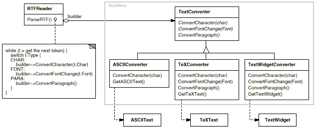
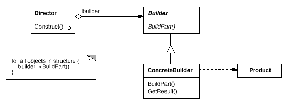
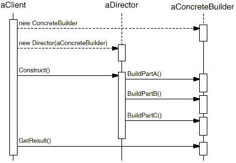

# {Builder} (GOF) 

## Intenção
Separar a construção de um objeto complexo da sua representação de modo que o mesmo processo de construção possa criar diferentes representações.

## Motivação
Um leitor de um documento em RTP (Rich Text Format) deveria ser capaz de converter RTP em muitos formatos de texto. O leitor poderia converter documentos RTP em texto ASCII comum ou widget de texto, que possa ser editado interativamente.

O problema, contudo, é que o número de conversões possíveis é aberto.

Por isso, deve ser fácil acrescentar uma nova conversão sem modificar o leitor.

Uma solução é configurar a classe RTFReader com um objeto TextConverter que converte RTF para uma outra representação de textos. A medida que o RTFReader analisa o documento RTF, ele usa o objeto TextConverter para efetuar a conversão. Sempre que o RTPReader reconhece um símbolo RTP (texto simples, ou uma palavra de controle do RTP), ele emite uma solicitação para o TextConverter para converter esse símbolo. Os objetos TextConverter são responsáveis tanto por efetuar a conversão dos dados como pela representação do símbolo num formato particular.

As subclasses de TextConverter se especializam em diferentes conversões e formatos. Por exemplo, um ASCIIConverter ignora solicitações para converter qualquer coisa, exceto texto simples. Por outro lado, um TeXConverter implementará operações para todas as solicitações visando produzir uma representação TEX que capture toda a informação estilística do texto. Um TextWidgetConverter produzirá um objeto para uma interface de usuário complexa que permite ao usuário ver e editar o texto.

<figure>

</figure>

Cada tipo de classe conversora implementa o mecanismo para criação e montagem de um objeto complexo, colocando-o atrás de uma interface abstrata. O conversor é separado do leitor, que é responsável pela análise de um documento RTF.

O padrão Builder captura todos estes relacionamentos. Cada classe conversora é chamada um builder no padrão, e o leitor é chamado de director. Aplicado a este exemplo, o Builder separa o algoritmo para interpretar um formato de texto (isto é, o analisador de documentos RTF) de como um formato convertido é  criado e representado. Isso nos permite reutilizar o algoritmo de análise (parsing) do RTFReader para criar diferentes representações de texto a partir de documentos RTF - simplesmente configure o RTFReader com diferentes subclasses de TextConverter.

## Aplicabilidade
Use o padrão Builder quando:
- o algoritmo para criação de um objeto complexo deve ser independente das partes que compõem o
objeto e de como elas são montadas.
- o processo de construção deve permitir diferentes representações para o objeto que é construído.

## Estrutura

<figure>

</figure>

## Participantes

- Builder(TextConverter)
  - especifica uma interface abstrata para criação de partes de um objeto produto.
- ConcreteBuilder (ASCUConverter, TeXConverter, TextWidgetConverter)
  - constrói e monta partes do produto pela implementação da interface de Builder;
  - define e mantém a representação que cria;
  - fornece uma interface para recuperação do produto (por exemplo, GetASCIIText, GetTextWidget).
- Director (RTFReader)
  - constrói um objeto usando a interface de Builder.
- Product (ASCIIText, TeXText, TextWidget).
  - representa o objeto complexo em construção. ConcreteBuilder constrói a representação interna do produto e define o processo pelo qual ele é montado;
  - inclui classes que definem as partes constituintes, inclusive as interfaces para a montagem das partes no resultado final.

## Colaborações

- O cliente cria o objeto Director e o configura com o objeto Builder desejado.
- Director notifica o construtor sempre que uma parte do produto deve ser construída.
- Builder trata solicitações do diretor e acrescenta partes ao produto.
- O cliente recupera o produto do construtor.

O seguinte diagrama de interação ilustra como Builder e Director cooperam com um cliente:

<figure>

</figure>

## Consequências
A seguir são apresentadas as consequências-chave da utilização do padrão Builder:
1. Permite variar a representação interna de um produto. O objeto Builder fornece ao diretor uma interface abstrata para a construção do produto. A interface permite ao construtor ocultar a representação e a estrutura interna do produto. Ela também oculta como o produto é montado. Já que o produto é construído através de uma interface abstrata, tudo o que você tem que fazer para mudar sua representação interna é definir um novo tipo de construtor.
1. Isola o código para construção e representação. O padrão Builder melhora a modularidade pelo encapsulamento da forma como um objeto complexo é construído e representado. Os clientes nada necessitam saber sobre as classes que definem a estrutura interna do produto; tais classes não aparecem na interface de Builder. Cada ConcreteBuilder contém todo o código para criar e montar um tipo de produto específico. O código é escrito somente uma vez; então, diferentes Directors podem reutilizá-lo para construir variantes de Product com o mesmo conjunto de partes. No exemplo anterior do RTF, nós poderíamos definir o leitor para um formato diferente do RTF, digamos um SGMLReader, e usado os mesmos TextConverters para gerar representações ASCIIText, TeXText, e TexWidget de documentos SGML.
1. Oferece um controle mais fino sobre o processo de construção. Ao contrário de padrões de criação que constroem produtos de uma só vez, o Builder constrói o produto passo a passo sob o controle do diretor.

Somente quando o produto está terminado o diretor o recupera do construtor. Daí a interface de Builder refletir o processo de construção do produto mais explicitamente do que outros padrões de criação. Isso dá um controle mais fino sobre o processo de construção e, consequentemente, da estrutura interna do produto resultante.
## Implementação

Existe uma classe abstrata Builder que define uma operação para cada componente que um diretor lhe pedir para criar. As operações não fazem nada por omissão. Uma classe ConcreteBuilder redefine as operações para os componentes que ela está interessada em criar.
Aqui apresentamos outros tópicos de implementação a serem considerados:

1. Interface de montagem e construção. Os Builders constroem os seus produtos de uma forma gradual. Portanto, a interface da classe Builder deve ser geral o bastante para permitir a construção de produtos para todos os tipos de construtores concretos.
    Um tópico-chave de projeto diz respeito ao modelo para o processo de construção e montagem. Um modelo onde os resultados das solicitações de construção são simplesmente acrescentados ao produto é normalmente suficiente. No exemplo do RTF, o construtor converte e acrescenta o próximo símbolo ao texto que converteu até aqui. Mas às vezes você pode necessitar acesso a partes do produto construídas anteriormente. No exemplo do labirinto que nós apresentamos no código de exemplo, a interface MazeBuilder permite acrescentar uma porta entre salas existentes. Estruturas de árvores, tais como árvores de derivação, que são construídas de baixo para cima (bottom-up), são um outro exemplo. Nesse caso, o construtor retornaria nós-filhos para o diretor, que então os passaria de volta ao construtor para construir os nós-pais.
2. Por que não classes abstratas para produtos? Nos casos comuns, os produtos produzidos pelos construtores concretos diferem tão grandemente na sua representação que há pouco a ganhar ao dar a diferentes produtos uma classe-pai comum. No exemplo do RTF, os objetos ASCIIText e TextWidget têm pouca probabilidade de ter uma interface comum, e tampouco necessitam de uma. Uma vez que o cliente em geral configura o diretor com o construtor concreto apropriado, o cliente está em posição de saber quais subclasses concretas de Builder estão em uso e pode tratar os seus produtos de acordo.
3. Métodos vazios como a omissão em Builder. Em C++, os métodos de construção são intencionalmente não-declarados como funções-membro. Em vez disso, eles são definidos como métodos vazios, permitindo aos clientes redefinirem somente as operações em que estão interessados.

## Padrão relacionados

<!--

//TODO

-->

## Referências

!!!include(../../ref.md)!!!
