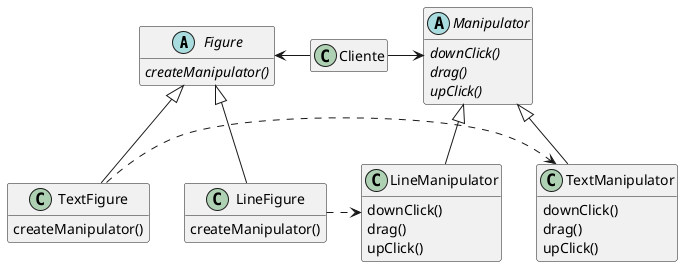

# Factory Method (GOF)

## Intenção

Definir uma interface para criar um objeto, mas deixar as subclasses decidirem que classe instanciar. O Factory Method permite adiar a instanciação para subclasses.

## Também conhecido como

Virtual Constructor

## Motivação

Os frameworks usam classes abstratas para definir e manter relacionamentos entre objetos. Um framework é freqüentemente responsável também pela criação desses objetos.

Considere um framework para aplicações que podem apresentar múltiplos documentos para o usuário. Duas abstrações-chave nesse framework são as classes Application (aplicação) e Document (documento). As duas classes são abstratas, e os clientes devem prover subclasses para realizar suas implementações específicas para a aplicação. Por exemplo, para criar uma aplicação de desenho, definimos as classes DrawingApplication e DrawingDocument. A classe Application é responsável pela administração de Documents e irá criá-los conforme exigido — quando o usuário seleciona Open (abrir) ou New (novo), por exemplo, num menu.

Uma vez que a subclasse Document a ser instanciada é própria da aplicação específica, a classe Application não pode prever a subclasse de Document a ser instanciada — a classe Application somente sabe quando um documento deve ser criado, e não que tipo de Document criar. Isso cria um dilema: o framework deve instanciar classes, mas ele somente tem conhecimento de classes abstratas, as quais não pode instanciar.

O padrão Factory Method oferece uma solução. Ele encapsula o conhecimento sobre a subclasse de Document que deve ser criada e move este conhecimento para fora do framework.

@startuml
abstract class Document{
    {abstract} open()
    {abstract} close()
    save()
    revert()
}

abstract class Application{
    {abstract} createDocument()
    newDocument()
    openDocument()
}

class MyApplication{
    createDocument()    
}

Document -o Application  :docs
Application <|-- MyApplication 
MyDocument <- MyApplication
Document  <|-- MyDocument 

note right of MyApplication::createDocument 
  return new MyDocument()
end note

note right of Application::newDocument 
  Document doc = new createDocument();
  docs.add(doc);
  doc.open();
end note

@enduml

As subclasses de `Application` redefinem uma operação abstrata `createDocument` em `Application` para retornar a subclasse apropriada de `Document.` Uma vez que uma subclasse de `Application` é instanciada, pode então instanciar `Documents` específicos da aplicação sem conhecer suas classes. Chamamos `createDocument` um **factory method** porque ele é responsável pela "manufatura" de um objeto.

## Aplicabilidade

Use o padrão Factory Method quando:

- uma classe não pode antecipar a classe de objetos que deve criam;
- uma classe quer que suas subclasses especifiquem os objetos que criam;
- classes delegam responsabilidade para uma dentre várias subclasses auxiliares, e você quer o conhecimento de qual subclasse auxiliar que é a delegada.

## Estrutura

@startuml
abstract class Product{
}

abstract class Creator{
    {abstract} factoryMethod()
    anOperation()
}

class ConcreteCreator{
    factoryMethod()
}

Creator <|-- ConcreteCreator 
ConcreteProduct <- ConcreteCreator
Product  <|-- ConcreteProduct 

note right of ConcreteCreator::factoryMethod 
  return new ConcreteProduct()
end note

note right of Creator::anOperation 
  ...
  product = factoryMethod();
  ...
end note

@enduml

## Participantes
- **Product** (Document)
    - define a interface de objetos que o `factoryMethod` cria.
- **ConcreteProduct** (MyDocument)
    - implementa a interface de `Product`.
- **Creator** (Application)
    - Declara o `factoryMethod`, o qual retorna um objeto do tipo `Product`. `Creator` pode também definir uma implementação por omissão do `factoryMethod` que retorna por omissão um objeto `ConcreteProduct`.
    - Pode chamar o `factoryMethod` para criar um objeto `Product.`
- **ConcreteCreator** (MyApplication)
    - Redefine o `factoryMethod` para retornar a uma instância de um
`ConcreteProduct.`

## Colaborações

- Creator depende das suas subclasses para definir o método fábrica de maneira que retorne uma instância do ConcreteProduct apropriado.

## Consequências

Os Factory Methods eliminam a necessidade de anexar classes específicas das aplicações no código. O código lida somente com a interface de `Product`; portanto, ele pode trabalhar com quaisquer classes `ConcreteProduct` definidas pelo usuário.

Uma desvantagem em potencial dos Factory Methods é que os clientes podem ter que fornecer subclasses da classe `Creator` somente para criar um objeto `ConcreteProduct` em particular. Usar subclasses é bom quando o cliente tem que fornecer subclasses a `Creator` de qualquer maneira, caso contrário, o cliente deve lidar com outro ponto de evolução.

Apresentamos aqui duas consequências adicionais do Factory Method:

1. Fornece ganchos para subclasses. Criar objetos dentro de uma classe com um método fábrica é sempre mais flexível do que criar um objeto diretamente. Factory Method dá às subclasses um gancho para fornecer uma versão estendida de um objeto. No exemplo de Documentos, a classe `Document` poderia definir um Factory Method chamado `createFileDialog` que cria um objeto file dialog por omissão para abrir um documento existente. Uma de `Document` pode definir um `fileDialog` específico da aplicação redefinindo este método fábrica. Neste caso, o método de fábrica não é abstrato, mas fornece uma implementação por omissão razoável.

2. Conecta hierarquias de classe paralelas. Nos exemplos que consideramos até aqui o Factory Method é somente chamado por `Creators`. Mas isto não precisa ser obrigatoriamente assim; os clientes podem achar os Factory Method úteis, especialmente no caso de hierarquias de classe paralelas. Hierarquias de classe paralelas ocorrem quando uma classe delega alguma das suas responsabilidades para uma classe separada. Considere, por exemplo, figuras que podem ser manipuladas interativamente; ou seja, podem ser esticadas, movidas ou giradas usando o mouse. Implementar tais interações não é sempre fácil. Isso frequentemente requer armazenar e atualizar informação que registra o estado da manipulação num certo momento. Este estado é necessário somente durante a manipulação; portanto, não necessita ser mantido no objeto-figura. Além do mais, diferentes figuras se comportam de modo diferente quando são manipuladas pelo usuário. Por exemplo, esticar uma linha pode ter o efeito de mover um dos extremos, enquanto que esticar um texto pode mudar o seu espaçamento de linhas.
Com essas restrições, é melhor usar um objeto `Manipulator` separado, que implementa a interação e mantém o registro de qualquer estado específico da manipulação que for necessário. Diferentes figuras utilizarão diferentes subclasses `Manipulator` para tratar interações específicas. A hierarquia de classes `Manipulator` resultante é paralela (ao menos parcialmente) à hierarquia de classes de `Figure`:

## Implementação
## Exemplo de código
## Usos conhecidos
## Padrão relacionados