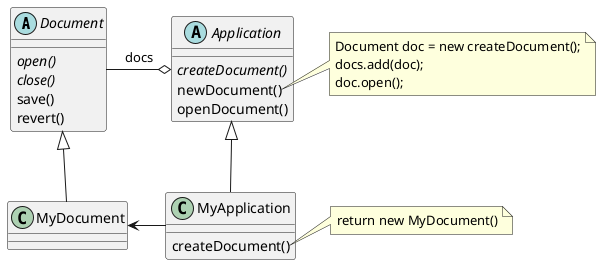
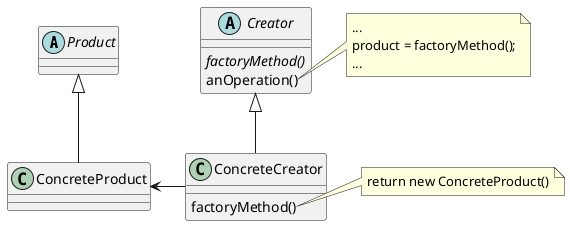

# Factory Method (GOF)

## Intenção

Definir uma interface para criar um objeto, mas deixar as subclasses decidirem que classe instanciar. O Factory Method permite adiar a instanciação para subclasses.

## Também conhecido como

Virtual Constructor

## Motivação

Os frameworks usam classes abstratas para definir e manter relacionamentos entre objetos. Um framework é freqüentemente responsável também pela criação desses objetos.

Considere um framework para aplicações que podem apresentar múltiplos documentos para o usuário. Duas abstrações-chave nesse framework são as classes Application (aplicação) e Document (documento). As duas classes são abstratas, e os clientes devem prover subclasses para realizar suas implementações específicas para a aplicação. Por exemplo, para criar uma aplicação de desenho, definimos as classes DrawingApplication e DrawingDocument. A classe Application é responsável pela administração de Documents e irá criá-los conforme exigido — quando o usuário seleciona Open (abrir) ou New (novo), por exemplo, num menu.

Uma vez que a subclasse Document a ser instanciada é própria da aplicação específica, a classe Application não pode prever a subclasse de Document a ser instanciada — a classe Application somente sabe quando um documento deve ser criado, e não que tipo de Document criar. Isso cria um dilema: o framework deve instanciar classes, mas ele somente tem conhecimento de classes abstratas, as quais não pode instanciar.

O padrão Factory Method oferece uma solução. Ele encapsula o conhecimento sobre a subclasse de Document que deve ser criada e move este conhecimento para fora do framework.

As subclasses de `Application` redefinem uma operação abstrata `createDocument` em `Application` para retornar a subclasse apropriada de `Document.` Uma vez que uma subclasse de `Application` é instanciada, pode então instanciar `Documents` específicos da aplicação sem conhecer suas classes. Chamamos `createDocument` um **factory method** porque ele é responsável pela "manufatura" de um objeto.

## Aplicabilidade

Use o padrão Factory Method quando:

- uma classe não pode antecipar a classe de objetos que deve criam;
- uma classe quer que suas subclasses especifiquem os objetos que criam;
- classes delegam responsabilidade para uma dentre várias subclasses auxiliares, e você quer o conhecimento de qual subclasse auxiliar que é a delegada.

## Estrutura

## Participantes
- **Product** (Document)
    - define a interface de objetos que o `factoryMethod` cria.
- **ConcreteProduct** (MyDocument)
    - implementa a interface de `Product`.
- **Creator** (Application)
    - Declara o `factoryMethod`, o qual retorna um objeto do tipo `Product`. `Creator` pode também definir uma implementação por omissão do `factoryMethod` que retorna por omissão um objeto `ConcreteProduct`.
    - Pode chamar o `factoryMethod` para criar um objeto `Product.`
- **ConcreteCreator** (MyApplication)
    - Redefine o `factoryMethod` para retornar a uma instância de um
`ConcreteProduct.`

## Colaborações

Em construção :construction:

## Consequências
## Implementação
## Exemplo de código
## Usos conhecidos
## Padrão relacionados