# Prototype (GOF) 🔨

[^GAMMA]


## Intenção
Especificar os tipos de objetos a serem criados usando uma instância-protótipo e criar novos objetos pela cópia desse protótipo.

## Motivação
Você poderia construir um editor para partituras musicais customizando um framework geral para editores gráficos, acrescentando novos objetos que representam notas, pausas e pentagramas. O editor do framework pode ter uma paleta de ferramentas para acrescentar esses objetos de música à partitura. A paleta também incluiria ferramentas para selecionar, mover e manipular objetos de música de outra forma. O usuário clicaria na ferramenta de uma semínima para adicionar semínimas à partitura. Ou poderia usar a ferramenta de movimentação para mover uma nota para cima ou para baixo nas linhas de pauta, desta forma alterando seu registro sonoro.

Vamos considerar que o framework forneça uma classe abstrata Graphic para componentes gráficos, como notas e pentagramas. Além disso, fornece uma classe abstrata Tool para definir ferramentas como aquelas da paleta. O framework também predefine uma subclasse GraphicTool para ferramentas que criam instâncias de objetos gráficos e os adicionam ao documento.

Mas GraphicTool apresenta um problema para o projetista do framework. As classes para notas e pentagramas são específicas da nossa aplicação, mas a classe GraphicTool pertence ao framework. GraphicTool não sabe como criar instâncias das nossas classes musicais para acrescentá-las à partitura. Poderíamos introduzir sub classes de GraphicTool para cada tipo de objeto musical, mas isso produziria muitas subclasses diferentes somente no tipo de objeto musical que elas instanciam. Sabemos que a composição de objetos é uma alternativa flexível para o uso de subclasses. A questão, porém, é, como pode um framework usá-la para parametrizar instâncias de GraphicTool pela Classe de Graphic que se espera que elas criem?

A solução é fazer Graph criar um novo Graphic copiando ou "clonando" uma instância de uma subclasse de Graphic. Chamamos esta instância de protótipo (prototype). A GraphicTool é parametrizada pelo protótipo que ela deveria clonar e acrescentar ao documento. Se todas as subclasses de Graphic suportam uma operação Clone, então GraphicTool pode clonar qualquer tipo de Graphic.

Assim, em nosso editor musical, cada ferramenta para criar um objeto musical é uma instância de GraphicTool que é iniciada com um protótipo diferente. Cada instância de GraphicTool produzirá um objeto musical clonando o seu protótipo e acrescentando o clone à partitura.

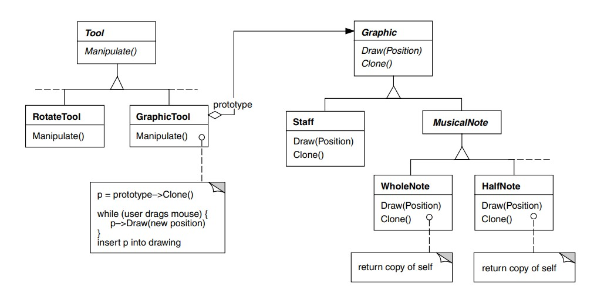

Podemos usar o padrão Prototype para reduzir o número de classes ainda mais. Temos classes separadas para breves e semibreves, mas isto é provavelmente desnecessário. Ao invés disso, poderiam ser instâncias da mesma classe iniciada com diferentes bitmaps e durações. Uma ferramenta para criação de notas do tipo breve torna-se somente uma GraphicTool cujo protótipo é uma MusicalNote iniciada como uma breve. Isso pode reduzir o número de classes no sistema dramaticamente. Isso também torna mais fácil acrescentar um novo tipo de nota ao editor musical.

## Aplicabilidade
Use o padrão Prototype quando um sistema tiver que ser independente de como os seus produtos são criados, compostos e representados; e

• quando as classes a instanciar forem especificadas em tempo de execução, por exemplo, por carga dinâmica; ou 

• para evitar a construção de uma hierarquia de classes de fábricas paralela à hierarquia de classes de produto; ou 

• quando as instâncias de uma classe puderem ter uma dentre poucas combinações diferentes de estados. Pode ser mais conveniente instalar um número correspondente de protótipos e cloná-los, ao invés de instanciar a classe manualmente, cada vez com um estado apropriado.

## Estrutura

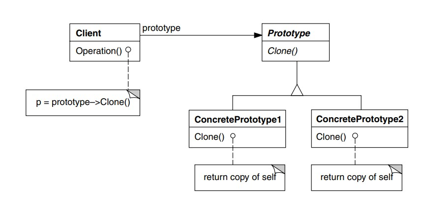
## Participantes
• Prototype (Graphic)

    – declara uma interface para clonar a si próprio.

• ConcretePrototype (Staff, Whole Nota, Half Note)

    – implementa uma operação para clonar a si próprio.

• Client (GraphicTool)

    – cria um novo objeto solicitando a um protótipo que clone a si próprio.

## Colaborações
• Um cliente solicita a um protótipo que este clone a si próprio.
## Consequências
Prototype tem muitas das mesmas consequências que Abstract Factory (95) e Builder
(104) têm: ele oculta as classes de produtos concretas do cliente, desta forma
reduzindo o número de nomes que os clientes necessitam saber. Além disso, esses
padrões permitem a um cliente trabalhar com classes específicas de uma aplicação sem
necessidade de modificação.

Os benefícios adicionais do padrão Prototype estão relacionados abaixo.
1. Acrescenta e remove produtos em tempo de execução. Prototype permite incorporar uma nova classe concreta de produto a um sistema, simplesmente registrando uma instância protótipo com o cliente. Isso é um pouco mais flexível do que outros padrões de criação, porque o cliente pode instalar e remover protótipos em tempo de execução.

2. Especifica novos objetos pela variação de valores. Sistemas altamente dinâmicos permitem definir novos comportamentos através da composição de objetos
– por exemplo, pela especificação de valores para as variáveis de um objeto
– e não pela definição de novas classes.
Você efetivamente define novos tipos de objetos pela instanciação das classes
existentes e registrando as instâncias como protótipos dos objetos-clientes.
Um cliente pode exibir um novo comportamento através da delegação de
responsabilidades para o protótipo.
Esse tipo de projeto permite aos usuários definir novas “classes” sem ter que
programar. De fato, clonar um protótipo é semelhante a instanciar uma classe.
O padrão Prototype pode reduzir grandemente o número de classes que um
sistema necessita. No nosso editor musical, uma classe GraphicTool pode criar
uma variedade ilimitada de objetos musicais.

3. Especifica novos objetos pela variação da estrutura. Muitas aplicações constroem
objetos com partes e subpartes. Por exemplo, editores para o projeto de
circuitos que constroem circuitos a partir de sub circuitos.1 Por questões de
conveniência, tais aplicações frequentemente permitem instanciar estruturas complexas, definidas pelo usuário, para, por exemplo, usar um sub circuito
específico repetidas vezes.
O padrão Prototype também suporta isso. Simplesmente adicionamos esse
sub circuito como um protótipo à paleta dos elementos de circuitos disponíveis. Contanto que o objeto-circuito composto implemente um clone por
replicação (deep copy), circuitos com diferentes estruturas podem ser protótipos.

4. Reduz o número de subclasses. O Factory Method (112) frequentemente produz
uma hierarquia de classes Creator paralela à hierarquia de classes do
produto. O padrão Prototype permite clonar um protótipo em vez de pedir a um
método fábrica para construir um novo objeto. Daí não necessitar-se de
nenhuma hierarquia de classes Creator. Esse benefício se aplica primariamente a linguagens como C++, que não tratam as classes como objetos de primeira
classe. As linguagens que assim o fazem, como Smalltalk e Objective C, obtêm
menos benefícios, uma vez que sempre se usa um objeto-classe como um
criador. Objetos-classe já funcionam como protótipos nessas linguagens.

5. Configura dinamicamente uma aplicação com classes. Alguns ambientes de tempo
de execução permitem carregar classes dinamicamente numa aplicação. O
padrão Prototype é a chave para a exploração de tais possibilidades numa
linguagem como C++.
Uma aplicação que quer criar instâncias de uma classe dinamicamente
carregada não será capaz de referenciar o seu constructor estaticamente. Em
vez disso, o ambiente de tempo de execução cria uma instância de cada classe
automaticamente, quando carregada, e registra a instância junto a um
gerenciador de protótipo (ver a seção Implementação). Então, a aplicação
pode solicitar ao gerenciador de protótipos instâncias de classes recém carregadas, classes essas que originalmente não estavam “linkadas” ao
programa. O framework de aplicações da ET++ [WGM88] tem um sistema de
tempo de execução que usa este esquema.

O principal ponto fraco do padrão Prototype é que cada subclasse de Prototype
deve implementar a operação Clone, o que pode ser difícil. Por exemplo, acrescentar
Clone é difícil quando as classes consideradas já existem. A implementação de Clone
pode ser complicada quando uma estrutura interna dessas classes inclui objetos que
não suportam operação de cópia ou têm referências circulares.

## Implementação

Prototype é particularmente útil com linguagens estáticas como C++, na qual as classes não são objetos, e pouca ou nenhuma informação sobre tipos está disponível em tempo de execução. Ele é menos importante em linguagens como Smalltalk ou Objective C, que
fornecem o equivalente a um protótipo (ou seja, um objeto-classe) para criação de
instâncias de cada classe. Este padrão está incorporado em linguagens baseadas em
protótipos como a Self [US87], na qual toda a criação de objetos se dá pela clonagem de
um protótipo.

Ao implementar protótipos levam-se em consideração os seguintes aspectos:

1. Usar um gerenciador de protótipos. Quando o número de protótipos num sistema
não é fixo (ou seja, eles podem ser criados e destruídos dinamicamente), é
importante manter um sistema de registro dos protótipos disponíveis. Os
clientes não vão gerenciar os protótipos, mas farão sua armazenagem e
recuperação pelo sistema de registro. Um cliente solicitará um protótipo ao
sistema de registro antes de cloná-lo. Nós chamamos esse sistema de registro
de gerenciador de protótipos.
Um gerenciador de protótipos é uma memória associativa que retorna o
protótipo correspondente a uma chave fornecida. Ele tem operações para
registrar um protótipo com uma chave e para removê-lo do registro. Os
clientes podem mudar ou mesmo pesquisar o registro em tempo de execução. Isso permite aos clientes estenderem e fazerem um inventário do sistema
sem necessidade de escrever linhas de código.

2. Implementar a operação Clone. A parte mais difícil do padrão Prototype é a
implementação correta da operação Clone. Ela é particularmente difícil
quando as estruturas de objetos contêm referências circulares.
A maioria das linguagens fornece algum suporte para clonagem de objetos. Por
exemplo, Smalltalk fornece uma implementação de copy que é herdada por
todas as subclasses de Object. C++ fornece um constructor copy. Mas estes
recursos não resolvem o problema shallow copy versus deep copy (cópia por
referência versus cópia por replicação) [GR83]. Ou seja, clonar objetos significa
clonar suas variáveis de instância, ou o clone e o original simplesmente
compartilham as variáveis?
Uma shallow copy é simples e, na maior parte das vezes, suficiente, e é o que o
Smalltalk fornece por omissão. O constructor de cópias por omissão em C++
faz uma cópia membro a membro, o que significa que os apontadores serão
compartilhados entre a cópia e o original. Porém, clonar protótipos com
estruturas complexas normalmente exige uma cópia por replicação (deep copy),
porque o clone e o original devem ser independentes. Portanto, você deve
garantir que os componentes do clone são clones dos componentes do protótipo. A clonagem força a decidir o que, se for o caso, será compartilhado.
Se os objetos no sistema fornecem operações de Salvar e Carregar, então você
pode usá-las para fornecer uma implementação por omissão de Clone
simplesmente salvando o objeto e carregando-o de volta imediatamente. A
operação Salvar salva o objeto num buffer de memória, e a operação Carregar
cria uma cópia por reconstrução do objeto a partir do buffer.

3. Iniciar clones. Enquanto alguns clientes ficam perfeitamente contentes com o
clone tal como ele é, outros desejarão iniciar alguns ou todos os seus estados
internos com valores de sua escolha.
Você geralmente não pode passar esses valores para operação Clone porque
o seu número variará entre as classes de protótipo. Alguns protótipos podem
necessitar de múltiplos parâmetros de inicialização; outros não necessitarão de nenhum. Passar parâmetros para a operação Clone impede uma interface
uniforme de clonagem.
Pode ser que suas classes-protótipo já definam operações para (re)estabelecer
estados-chave. Caso isso aconteça, os clientes podem usar essas operações
imediatamente após a clonagem. Se isso não acontecer, então você pode ter que
introduzir uma operação Initialize(ver a seção de Exemplo de Código) que
recebe parâmetros de inicialização como argumentos e estabelece o estado
interno do clone de acordo. Cuidado com as operações clone que usam
replicação (deep copying) – as cópias podem ter que ser deletadas (ou explicitamente, ou dentro de Initialize) antes de você reinicializá-la

## Estrutura do Código

<figure>

@startuml
     
     abstract class Shape{
        +int x
        +int y
        +String color

        {abstract} Shape clone()
    }

    class Circle extends Shape{
        +int radius

        +Shape clone()
    } 

    class Rectangle extends Shape{
        +int width
        +int height

        +Shape clone()
    }

    

    @enduml

<figcaption>Estrutura do Código Prototype.</figcaption>
</figure>

## Exemplo de código

shapes: Lista de formas
 
 shapes/Shape.java: Interface comum de forma
```java
import java.util.Objects;

public abstract class Shape {
    public int x;
    public int y;
    public String color;

    public Shape() {
    }

    public Shape(Shape target) {
        if (target != null) {
            this.x = target.x;
            this.y = target.y;
            this.color = target.color;
        }
    }

    public abstract Shape clone();

    @Override
    public boolean equals(Object object2) {
        if (!(object2 instanceof Shape)) return false;
        Shape shape2 = (Shape) object2;
        return shape2.x == x && shape2.y == y && Objects.equals(shape2.color, color);
    }
}
```
shapes/Circle.java: Form simples
```java
public class Circle extends Shape {
    public int radius;

    public Circle() {
    }

    public Circle(Circle target) {
        super(target);
        if (target != null) {
            this.radius = target.radius;
        }
    }

    @Override
    public Shape clone() {
        return new Circle(this);
    }

    @Override
    public boolean equals(Object object2) {
        if (!(object2 instanceof Circle) || !super.equals(object2)) return false;
        Circle shape2 = (Circle) object2;
        return shape2.radius == radius;
    }
}
```
shapes/Rectangle.java: Outra forma

```java
public class Rectangle extends Shape {
    public int width;
    public int height;

    public Rectangle() {
    }

    public Rectangle(Rectangle target) {
        super(target);
        if (target != null) {
            this.width = target.width;
            this.height = target.height;
        }
    }

    @Override
    public Shape clone() {
        return new Rectangle(this);
    }

    @Override
    public boolean equals(Object object2) {
        if (!(object2 instanceof Rectangle) || !super.equals(object2)) return false;
        Rectangle shape2 = (Rectangle) object2;
        return shape2.width == width && shape2.height == height;
    }
}
```

Demo.java: Exemplo de clonagem

```java
import refactoring_guru.prototype.example.shapes.Circle;
import refactoring_guru.prototype.example.shapes.Rectangle;
import refactoring_guru.prototype.example.shapes.Shape;

import java.util.ArrayList;
import java.util.List;

public class Demo {
    public static void main(String[] args) {
        List<Shape> shapes = new ArrayList<>();
        List<Shape> shapesCopy = new ArrayList<>();

        Circle circle = new Circle();
        circle.x = 10;
        circle.y = 20;
        circle.radius = 15;
        circle.color = "red";
        shapes.add(circle);

        Circle anotherCircle = (Circle) circle.clone();
        shapes.add(anotherCircle);

        Rectangle rectangle = new Rectangle();
        rectangle.width = 10;
        rectangle.height = 20;
        rectangle.color = "blue";
        shapes.add(rectangle);

        cloneAndCompare(shapes, shapesCopy);
    }

    private static void cloneAndCompare(List<Shape> shapes, List<Shape> shapesCopy) {
        for (Shape shape : shapes) {
            shapesCopy.add(shape.clone());
        }

        for (int i = 0; i < shapes.size(); i++) {
            if (shapes.get(i) != shapesCopy.get(i)) {
                System.out.println(i + ": Shapes are different objects (yay!)");
                if (shapes.get(i).equals(shapesCopy.get(i))) {
                    System.out.println(i + ": And they are identical (yay!)");
                } else {
                    System.out.println(i + ": But they are not identical (booo!)");
                }
            } else {
                System.out.println(i + ": Shape objects are the same (booo!)");
            }
        }
    }
}
```
OutputDemo.txt: Resultados da execução

```JAVA
0: Shapes are different objects (yay!)
0: And they are identical (yay!)
1: Shapes are different objects (yay!)
1: And they are identical (yay!)
2: Shapes are different objects (yay!)
2: And they are identical (yay!)
```

## Exemplo de código Livro

Definiremos uma subclasse MazePrototypeFactory da classe MazeFactory (página
100). MazePrototypeFactory será iniciada com protótipos dos objetos que criará, de
maneira que não tenhamos que criar subclasses somente para mudar as classes de
paredes ou salas que ela cria.

A MazePrototypeFactory aumenta a interface de Maze Factory com um constructor que aceita os protótipos como argumentos:

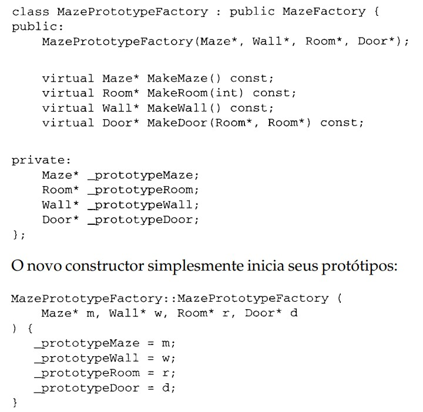

As funções-membro para a criação de paredes, salas e portas são semelhantes:
cada uma clona um protótipo e então o inicia. Aqui estão as definições de MakeWall e MakeDoor:

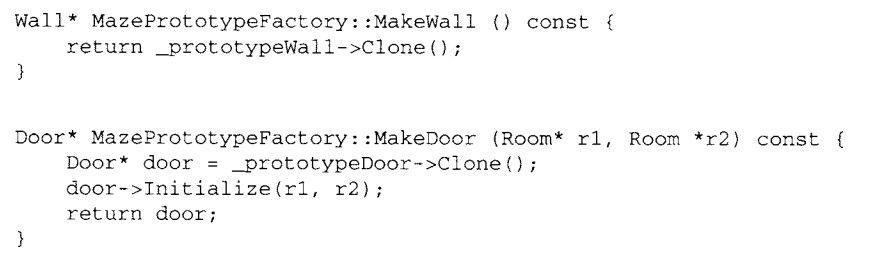

Podemos usar MazePrototypeFactory para criar um labirinto-protótipo (ou um
labirinto por omissão) simplesmente iniciando-o com protótipos dos componentes
básicos de labirinto:

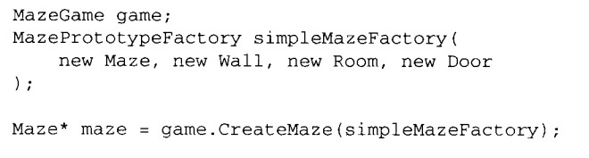

Para mudar o tipo de labirinto, iniciamos MazePrototypeFactory com um
conjunto diferente de protótipos. A seguinte chamada cria um labirinto com uma
BombedDoor e um RoomWithABomb:

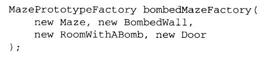

Um objeto que pode ser usado como um protótipo, tal como uma instância de
Wall, deve suportar a operação Clone. Ele também deve ter um constructor de cópias
para fazer a clonagem. Também pode necessitar de uma operação separada para a
reinicialização do estado interno. Acrescentaremos a operação Initialize à Door
para permitir aos clientes inicializarem as salas do clone.
Compare a seguinte definição de Door com da página 93

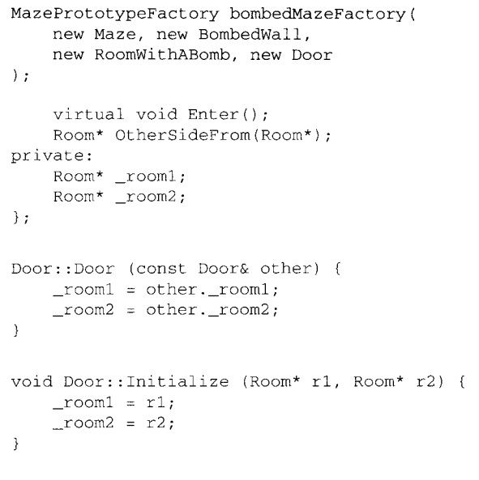


A subclasse BombedWall deve redefinir Clone e implementar um constructor de
cópias correspondente.

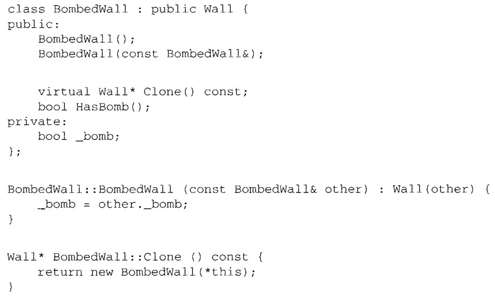

Embora BombedWall::Clone retorne um Wall*, sua implementação retorna
um ponteiro para uma nova instância de uma subclasse, qual seja, um BombedWall*.
Definimos Clone desta maneira na classe-base para nos assegurarmos de que os
clientes que clonam o protótipo não tenham que conhecer suas subclasses concretas.
Clientes nunca deveriam precisar fazer um downcast do valor de retorno de Clone
para o tipo desejado.
Em Smalltalk, você pode reutilizar o método-padrão copy herdado de Object
para clonar qualquer MapSite. Você pode usar MazeFactory para produzir os
protótipos de que necessita; por exemplo, pode criar uma sala fornecendo o nome
#room.
A MazeFactory (fábrica de labirintos) tem um dicionário que mapeia nomes aos
protótipos. Seu método make: se parece com o seguinte:

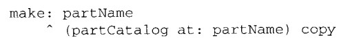

Tendo métodos apropriados para inicia a MazeFactory com protótipos, você
poderia criar um labirinto simples com o seguinte código:

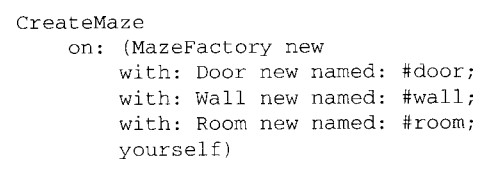

onde a definição do método de classe on: para CreateMaze seria

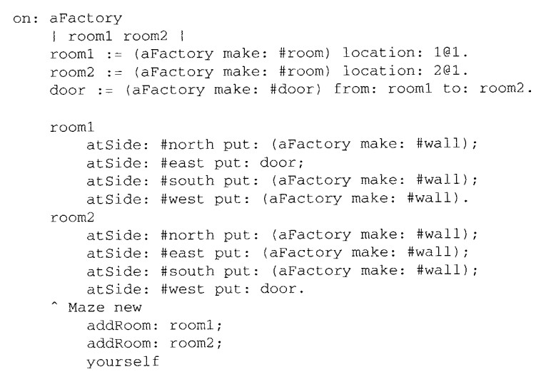

## Usos conhecidos

Talvez o primeiro exemplo do padrão Prototype se encontre no sistema Sketchpad de Ivan Sutherland [Sut63]. A primeira aplicação amplamente conhecida do padrão numa linguagem orientada a objeto foi em ThingLab, na qual os usuários poderiam formar um objeto composto e então promovê-lo a um protótipo pela sua instalação numa
biblioteca de objetos reutilizáveis [Bor81]. Goldberg e Robson mencionam protótipos como um padrão [GR83], mas Coplien [Cop92] fornece uma descrição muito mais completa. Ele descreve idiomas relacionados ao padrão prototype para C++ e dá muitos exemplos e variações.

O Etgdb é um depurador (debugger) de front-end, baseado em ET++, que fornece
uma interface de apontar e clicar para diferentes depuradores orientados a linhas.
Cada depurador tem uma subclasse DebuggerAdaptor correspondente. Por exemplo, GdbAdaptor adapta o etgdb à sintaxe dos comandos do gdb de GNU, enquanto que SunDbxAdaptor adapta o etgdb ao depurador da Sun. O Etgdb não tem um conjunto de classes DebuggerAdaptor codificadas rigidamente nele próprio. Em vez disso, lê o nome do adaptor a ser usado de uma variável fornecida pelo ambiente,
procura um protótipo com o nome especificado em uma tabela global e, então, clona o protótipo. Novos depuradores podem ser acrescentados ao etgdb ligando-o ao DebuggerAdaptor que funciona para um depurador novo.

A “biblioteca de técnicas de interações”, no ModeComposer, armazena protótipos de objetos que suportam várias técnicas de interação [Sha90]. Qualquer técnica
de interação criada pelo Mode Composer pode ser usada como um protótipo
colocando-a nesta biblioteca. O padrão Prototype permite ao Mode Composer suportar um conjunto ilimitado de técnicas de interação.

O exemplo do editor musical discutido anteriormente se baseia no framework
para desenhos do Unidraw [VL90].
## Padrão relacionados

Prototype e Abstract Factory (95) são padrões que competem entre si em várias situações, como discutimos no final deste capítulo. Porém, eles também podem ser usados em conjunto. Um Abstract Factory pode armazenar um conjunto de protótipos a partir dos quais podem ser clonados e retornados objetos-produto.

Projetos que utilizam intensamente os padrões Composite (160) e Decorator (170)
também podem se beneficiar do uso do Prototype.

## Referências

PROTOTYPE: Criação de Objetos. In: GAMMA, ERICH; HELM, RICHARD; JOHNSON, RALPH; VLISSIDES, JOHN. Padrões de Projeto: Soluções reutilizáveis de software orientado a objetos. [S. l.: s. n.], 2000.

REFACTORING.GURU. Prototype em Java. [S. l.], 3 abr. 2022. Disponível em: https://refactoring.guru/pt-br/design-patterns/prototype/java/example. Acesso em: 7 abr. 2022.